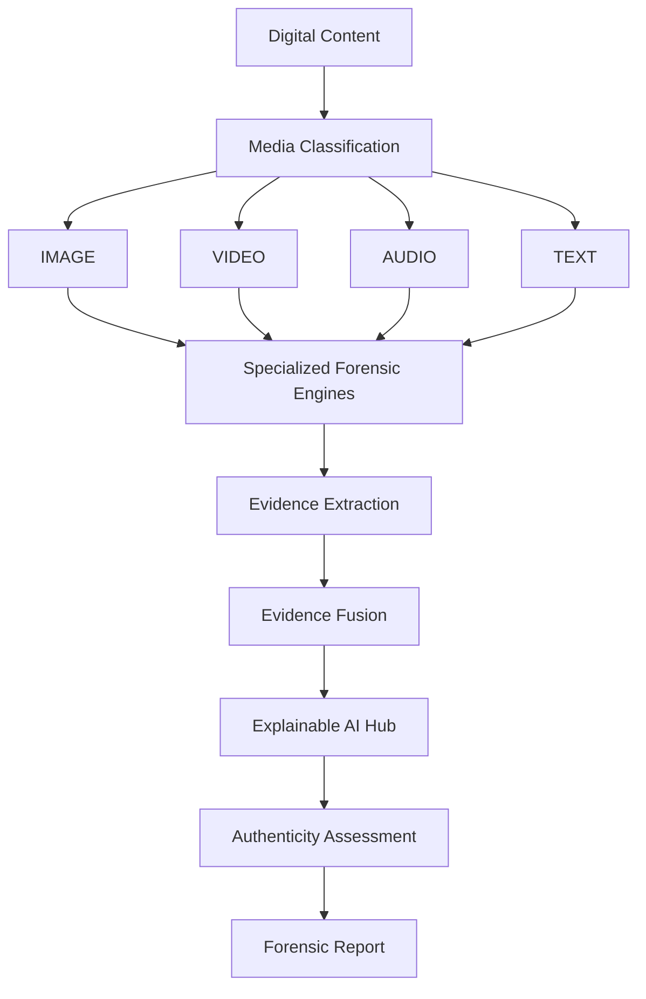

# REALCHECK AI

> **Tagline:** *“Don’t just detect. Investigate, explain, and verify.”*

[](LICENSE)
[](https://fastapi.tiangolo.com)
[](https://react.dev)
[](https://vitejs.dev)

**REALCHECK AI** is an explainable digital media authenticity and forensic analysis platform. It moves beyond simplistic black-box binary verdicts ("Real" vs. "Fake") by delivering an open, probabilistic, multi-signal evidence fusion pipeline that inspects, decomposes, and visually explains synthetic alterations across **Image**, **Video**, **Audio**, and **Text**.

---

## Table of Contents

- [1. Overview](#1-overview)
- [2. Problem Statement](#2-problem-statement)
- [3. Proposed Solution](#3-proposed-solution)
- [4. Key Features](#4-key-features)
- [5. Implementation Status & Component Classification](#5-implementation-status--component-classification)
- [6. Evaluation & Benchmarking Suite](#6-evaluation--benchmarking-suite)
- [7. Four Media Analysis Engines](#7-four-media-analysis-engines)
- [8. Explainable AI](#8-explainable-ai)
- [9. Evidence Fusion](#9-evidence-fusion)
- [10. Authenticity Assessment](#10-authenticity-assessment)
- [11. Heatmap Analysis](#11-heatmap-analysis)
- [12. Video Timeline Analysis](#12-video-timeline-analysis)
- [13. Audio Spectral Analysis](#13-audio-spectral-analysis)
- [14. Text Stylometry](#14-text-stylometry)
- [15. Forensic Reports](#15-forensic-reports)
- [16. System Architecture](#16-system-architecture)
- [17. Technology Stack](#17-technology-stack)
- [18. Project Structure](#18-project-structure)
- [19. Installation](#19-installation)
- [20. Frontend Setup](#20-frontend-setup)
- [21. Backend Setup](#21-backend-setup)
- [22. Environment Variables](#22-environment-variables)
- [23. Running the Application](#23-running-the-application)
- [24. Demo Mode](#24-demo-mode)
- [25. API Endpoints](#25-api-endpoints)
- [26. Screenshots & Visual Interface](#26-screenshots--visual-interface)
- [27. Limitations](#27-limitations)
- [28. Privacy and Security](#28-privacy-and-security)
- [29. Future Scope](#29-future-scope)
- [30. License](#30-license)

---

## 1. Overview

As generative diffusion models, neural speech synthesizers, facial reenactment pipelines, and large language models become ubiquitous, establishing the provenance and integrity of digital media is paramount. **REALCHECK AI** provides digital forensics investigators, journalists, legal analysts, and cybersecurity teams with a multi-modal inspection cockpit.

Instead of providing an unverified confidence score, REALCHECK AI decomposes digital artifacts into independent forensic signals, projects explainability maps (Grad-CAM, spectral graphs, temporal timelines, syntactic metrics), fuses the evidence, and generates audit-ready forensic dockets.

---

## 2. Problem Statement

1. **The Black-Box Dilemma:** Most deepfake and AI text detectors produce a single percentage or boolean label without explaining *why* the media was flagged.
2. **Single-Modality Blindness:** Real-world disinformation campaigns deploy cross-modal assets (e.g., cloned audio combined with re-rendered video and synthetic news text). Isolated detectors fail to cross-correlate these clues.
3. **High False-Positive Friction:** Innocent compression artifacts (JPEG blocks, H.264 macroblocking, recording reverberation) frequently trigger false alarms when nuance is missing.
4. **Lack of Legal & Investigative Rigor:** Investigators require verifiable signal breakdowns, metadata inspection, and exportable forensic reports that document chain-of-custody and method limitations.

---

## 3. Proposed Solution

REALCHECK AI introduces a modular, explainable multi-signal forensic framework:
- **Multi-Modal Coverage:** Dedicated analysis engines for Image, Video, Audio, and Text in a unified dashboard.
- **Probabilistic Evidence Fusion:** Bayesian synthesis that correlates multiple independent forensic signals and handles conflicting evidence transparently.
- **Explainability First:** Visual Grad-CAM overlays, 2D Fourier FFT spectrum drawers, audio spectrograms, frame-by-frame temporal timelines, and syntactic burstiness distributions.
- **Forensic Transparency:** Every assessment includes confidence ratings, strength classifications, affected bounding boxes/timestamps, and explicit limitation notices.

---

## 4. Key Features

- 🔬 **Multi-Signal Decomposition:** 4–5 specialized signal checks per media type.
- 🎯 **Interactive Heatmap Workspace:** Adjustable Grad-CAM overlay opacity, bounding box inspection, and Fourier/PRNU sensor residual views.
- ⏱️ **Frame-by-Frame Video Scrubber:** Temporal timeline with color-coded suspicion flags, facial landmark meshes, and lip-sync disparity curves.
- 🎙️ **Audio Spectrogram & Waveform Oscilloscope:** Visual acoustic formant analysis, pitch micro-jitter tracking, and voice clone window isolation.
- ✍️ **Text Stylometric Profiler:** Syntactic burstiness, token perplexity distribution entropy, formulaic discourse transition counts, and AI trope detection.
- 🌐 **Centralized Explainable AI Hub:** Cross-engine convergence tree displaying live micro-service response times and interactive signal attribution graphs.
- 📁 **Investigation Workspace (Case Dossier):** Multi-artifact pinboard for linking multiple files in a single case and performing cross-media evidence fusion.
- 📑 **Audit-Grade Forensic Reports:** Instant generation of printable HTML forensic dockets, structured JSON, and CSV matrices.
- ⌨️ **Global Command Palette (`Ctrl+K`):** Fast navigation across cases, engines, high-risk anomalies, and documentation.

---

## 5. Implementation Status & Component Classification

To ensure engineering transparency and scientific rigor, the components of REALCHECK AI are explicitly classified into three distinct categories based on codebase inspection:

### A. Real Implementations (Production & Verified Infrastructure)
- **FastAPI Backend Architecture:** Full modular REST API (`app/main.py`, `app/api/*`) with dependency injection, health checks, and strict Pydantic v2 validation.
- **Relational Persistence Layer:** SQLite / PostgreSQL database integration via SQLAlchemy ORM with Alembic schema migrations and models (`Investigation`, `User`, `Job`, `Batch`).
- **Enterprise Security & Auth:** JWT bearer token authentication, secure password hashing (bcrypt), and enterprise API key authorization with role-based access control (RBAC).
- **Asynchronous Task Queue:** Celery worker + Redis backend architecture for decoupled media processing.
- **Forensic Report Generator:** Deterministic rendering of printable HTML forensic dockets, structured JSON dockets, and CSV tabular matrices (`app/reports/generator.py`).
- **Evaluation & Benchmarking Suite:** Pluggable benchmark runner (`backend/evaluation/benchmark.py`), manifest provenance and verification manager (`backend/evaluation/dataset.py`), confidence calibrator (ECE, Brier score, Temperature & Platt scaling in `backend/evaluation/calibration.py`), and test suite (`backend/test_benchmark.py`).
- **Frontend SPA Cockpit:** Production React 19 + TypeScript client with cybersecurity SOC theme, live API polling, and case dossier management (`frontend/src/`).

### B. Heuristic-Experimental Components (Active Baseline Analytical Engines)
- **Image Forensic Detector:** Pillow / NumPy computational baseline calculating global pixel variance and EXIF metadata extraction (`app/detectors/image/detector.py`). *Note: Member 1 is developing and fine-tuning the production deep learning vision model to replace this baseline.*
- **Video Forensic Detector:** OpenCV inter-frame temporal differencing and motion variance metrics (`app/detectors/video/detector.py`).
- **Audio Forensic Detector:** Librosa acoustic signal processor computing spectral roll-off, spectral centroid, zero-crossing rate, and energy dynamics (`app/detectors/audio/detector.py`).
- **Text Stylometry Analyzer:** Deterministic token statistics, sentence burstiness, vocabulary entropy, and repetition heuristics (`app/detectors/text/detector.py`).
- **Evidence Fusion Hub:** Score-spread variance and weighted cross-media Bayesian aggregator (`app/forensics/fusion.py`).

### C. Simulated / In-Development Prototype Components
- **Pre-Baked Demonstration Cases:** Static mock cases (`SAMPLE_CASES` in frontend, `INVESTIGATIONS_DB` in backend) provided for offline demo previews.
- **Grad-CAM Saliency Overlays:** Heatmap bounding boxes in demo cases are currently simulated prototype overlays awaiting live neural activation maps from the ML model.
- **Neural Model Registry Metadata:** Speculative target descriptions in `/api/models` (e.g. "Vision Transformer + Spectral ResNet", "3D-CNN") representing target production checkpoints not yet connected to live model weights.
- **Official Model Benchmark Metrics:** Currently **Not yet evaluated** pending integration and testing of Member 1's machine learning model.

---

## 6. Evaluation & Benchmarking Suite

The evaluation infrastructure (developed in Phase 1) provides a reproducible benchmark pipeline for measuring actual detector performance without synthetic inflation.

### Benchmark Capabilities
- **Metrics Calculated:** Accuracy, Precision (PPV), Recall (TPR / Sensitivity), Specificity (TNR), Negative Predictive Value (NPV), F1-Score, and complete Confusion Matrix.
- **Confidence Calibration:** Expected Calibration Error (ECE), Brier Score, Reliability Curves, and post-hoc Temperature Scaling / Platt Scaling.
- **Anti-Leakage Protocol:** Calibration parameters are strictly fitted on a dedicated `calibration` split, never on the `test` split.
- **Dynamic Model Loading:** The benchmark runner loads detector classes dynamically via `--detector`, allowing Member 1's upcoming ML model to plug in seamlessly.

### Current Image Detector Benchmark Status
| Metric | Baseline Heuristic (Pixel Variance) | Member 1 ML Model (Upcoming) |
|---|---|---|
| **Accuracy** | *Pipeline test only (not a model)* | **Not yet evaluated** |
| **Precision** | *Pipeline test only (not a model)* | **Not yet evaluated** |
| **Recall** | *Pipeline test only (not a model)* | **Not yet evaluated** |
| **F1-Score** | *Pipeline test only (not a model)* | **Not yet evaluated** |
| **Calibration (ECE)**| *Uncalibrated heuristic* | **Not yet evaluated** |

*For complete model details and specifications, see [`docs/MODEL_CARD_IMAGE_DETECTOR.md`](docs/MODEL_CARD_IMAGE_DETECTOR.md).*

### Running Benchmark & Unit Tests
```bash
# Run unit tests verifying metric calculations against hand-made test arrays:
cd backend
python test_benchmark.py

# Run benchmark runner on an evaluation manifest:
python -m evaluation.benchmark --manifest evaluation/manifest_template.json --detector app.detectors.image.detector.ImageDetector --split test
```

---

## 7. Four Media Analysis Engines

| Engine | Core Forensic Signals Analyzed | Primary Focus |
|---|---|---|
| **Image Forensics** | • Diffusion Texture Variance<br>• 2D Fourier FFT Spectral Harmonics<br>• Sensor PRNU Correlation Residuals<br>• Bayer Demosaicing Covariance | Detects synthetic diffusion artifacts, frequency checkerboards, and sensor mismatch. |
| **Video Forensics** | • Spatial-Temporal Flow Continuity<br>• Phoneme-Viseme Lip-Sync Disparity<br>• Facial Boundary Seam Blending<br>• Biological Blink Micro-Dynamics | Identifies face-swapping, neural reenactment, and temporal jitter. |
| **Audio Forensics** | • Mel-Spectrogram Formant Continuity<br>• Pitch Micro-Jitter & Tremor Absence<br>• Physiological Breath Inhalation Presence<br>• Vocoder High-Frequency Phase Drift | Spots voice cloning, TTS synthesis, and audio splicing. |
| **Text Stylometry** | • Syntactic Burstiness Variance<br>• Token Perplexity Entropy Distribution<br>• Formulaic Discourse Transitions<br>• Repetitive AI Cliché / Trope Density | Evaluates human vs. LLM syntactic distribution and vocabulary uniformity. |

---

## 8. Explainable AI

Explainability is the core foundation of REALCHECK AI:
- **Visual Saliency (Grad-CAM):** Highlights the exact spatial regions contributing to anomaly detection.
- **Attribution Weighting:** Displays the mathematical contribution percentage of each independent detector toward the final score.
- **Plain-Language Rationales:** Every detected anomaly provides a clear explanation detailing the underlying forensic phenomenon.
- **"Why This Result?" Inspector:** An interactive modal on every case breaking down the positive and negative evidence factors.

---

## 9. Evidence Fusion

When investigating complex cases, single signals can be inconclusive. REALCHECK AI's **Evidence Fusion Hub**:
1. Normalizes scores from all active detectors into a calibrated 0–100 scale.
2. Applies evidence weighting based on signal robustness and domain confidence.
3. Detects **signal conflicts** (e.g., metadata looks pristine but acoustic harmonics reveal synthetic vocoder drift) and flags them with an `Uncertain / Mixed Evidence` status.
4. Performs cross-media Bayesian synthesis to derive an overall case verdict.

---

## 10. Authenticity Assessment

Each analyzed item receives an assessment profile:

| Metric | Range / Values | Description |
|---|---|---|
| **Authenticity Score** | `0 - 100` | Higher score indicates higher likelihood of authentic, unaltered media. |
| **Assessment Verdict** | `Likely Authentic`, `Suspicious / Modified`, `High-Confidence Synthetic`, `Uncertain / Mixed Evidence` | Standardized categorization of the evidence. |
| **Risk Level** | `Low`, `Medium`, `High`, `Critical` | Actionable risk classification for content moderators and analysts. |
| **Confidence Level** | `Low`, `Moderate`, `High`, `Very High` | Epistemic certainty based on signal consensus and input quality. |

---

## 11. Heatmap Analysis

The Image Forensics workspace features an interactive canvas allowing analysts to:
- Blend Grad-CAM anomaly heatmaps over original source images with an opacity slider.
- Inspect localized bounding boxes highlighting specific facial gradient inconsistencies or unnatural hair/eye textures.
- View 2D Fourier FFT transform spectra to identify high-frequency periodic grid artifacts generated by upsampling layers.
- Inspect Sensor PRNU (Photo Response Non-Uniformity) noise residuals.

---

## 12. Video Timeline Analysis

Deepfake video manipulation often leaves temporal footprints. The Video Forensics workspace provides:
- A frame-by-frame scrubber timeline (`00:00 ─── 00:05 ─── 00:10 ─── 00:15 ─── 00:20`) with color-coded suspicion markers (Green = Normal, Amber = Flagged, Red = Critical Anomaly).
- Facial landmark wireframe overlays tracking 68 facial points for temporal jitter.
- Lip-sync viseme-phoneme disparity graphs that correlate audio energy with mouth aperture.

---

## 13. Audio Spectral Analysis

The Audio Authenticity engine provides deep acoustic visualization:
- Interactive Mel-frequency spectrogram and time-domain waveform oscilloscope.
- Automated highlight windows identifying exact timestamps where synthetic vocoders or voice-clone splices were inserted.
- Formant continuity checking and pitch micro-jitter variance analysis to confirm human vocal tract physics.

---

## 14. Text Stylometry

The Text Stylometry engine examines written content for large language model generation patterns:
- **Burstiness Meter:** Measures variance in sentence lengths and structural complexity (human writing exhibits high burstiness; LLMs exhibit uniform cadence).
- **Perplexity Entropy:** Estimates the predictability of token distributions.
- **Stylistic Marker Highlights:** Flags formulaic discourse signposts (e.g., *"In conclusion, it is important to remember..."*, *"delves into"*, *"testament to"*).

---

## 15. Forensic Reports

REALCHECK AI generates structured, exportable reports suitable for legal dossiers, newsroom verification, and security incident response:
- **Printable HTML Docket:** A formatted layout with header stamps, case UUIDs, file checksums, signal scorecards, and legal disclaimers.
- **Structured JSON:** Machine-readable payload containing all raw signals, bounding boxes, and model metadata.
- **CSV Signal Matrix:** Tabular signal-by-signal export for spreadsheet analysis.

---

## 16. System Architecture



---

## 17. Technology Stack

### Frontend
- **Framework:** React 19, TypeScript
- **Build Tool:** Vite
- **Styling:** Custom Cybersecurity SOC & Glassmorphism Design System (`index.css`)
- **Icons:** Lucide React
- **Client Architecture:** Service layer with real-time API communication and standalone demo fallback

### Backend
- **API Framework:** FastAPI (Python 3.10+)
- **ASGI Server:** Uvicorn
- **Data Validation:** Pydantic v2 schemas
- **Computation:** NumPy, Python Standard Library (hashlib, io, csv, json)
- **Architecture:** Pluggable `BaseDetector` interface with decoupled detector modules

### DevOps & Containerization
- **Docker:** Multi-stage container builds for frontend and backend
- **Docker Compose:** Orchestration for zero-configuration local deployment

---

## 18. Project Structure

```
REALCHECK-AI/
├── .gitignore               # Comprehensive Git ignore rules
├── .env.example             # Environment variables template
├── docker-compose.yml       # Docker Compose orchestration
├── README.md                # Project documentation
├── backend/
│   ├── Dockerfile           # Backend container definition
│   ├── requirements.txt     # Python dependencies
│   └── app/
│       ├── main.py          # FastAPI application entrypoint & CORS config
│       ├── api/
│       │   └── routes.py    # REST API endpoints (/health, /analyze/*, /reports/*)
│       ├── detectors/
│       │   ├── base.py      # Abstract BaseDetector class
│       │   ├── image/       # Image forensic detector module
│       │   ├── video/       # Video spatial-temporal detector module
│       │   ├── audio/       # Audio spectrogram detector module
│       │   └── text/        # Text stylometry detector module
│       ├── forensics/
│       │   ├── database.py  # In-memory case repository & benchmark cases
│       │   └── fusion.py    # Multi-signal Bayesian evidence fusion hub
│       ├── reports/
│       │   └── generator.py # JSON, CSV, and HTML report generator
│       └── schemas/
│           └── forensics.py # Pydantic v2 data models
└── frontend/
    ├── Dockerfile           # Frontend container definition
    ├── index.html           # HTML template
    ├── package.json         # NPM packages and scripts
    ├── tsconfig.json        # TypeScript configuration
    ├── vite.config.ts       # Vite build configuration
    └── src/
        ├── App.tsx          # Main application router and shell
        ├── index.css        # Core SOC glassmorphism design tokens
        ├── components/      # UI components (Header, Footer, ScoreMeter, etc.)
        ├── data/            # Pre-calibrated benchmark cases
        ├── pages/           # Dedicated forensic views & workspaces
        ├── services/        # API client layer with demo mode fallback
        └── types/           # TypeScript forensic data interfaces
```

---

## 19. Installation

### Prerequisites
- **Node.js:** v18.0.0 or higher
- **Python:** v3.10 or higher
- **Git:** Latest version

Clone the repository:
```bash
git clone https://github.com/vmukesharav-sudo/REALCHECK-AI.git
cd REALCHECK-AI
```

---

## 20. Frontend Setup

```bash
cd frontend
npm install
```

---

## 21. Backend Setup

```bash
cd backend
python -m venv venv

# On Windows:
.\venv\Scripts\activate
# On Linux/macOS:
source venv/bin/activate

pip install -r requirements.txt
```

---

## 22. Environment Variables

Create `.env` in the project root or configure respective directories using `.env.example`:

```env
# Application Environment
ENVIRONMENT=development
PORT=8000
HOST=0.0.0.0

# Frontend Configuration
VITE_API_URL=http://localhost:8000/api
VITE_APP_TITLE=REALCHECK AI

# Detector Engine Settings
ENABLE_DEMO_MODE=true
```

---

## 23. Running the Application

### Option A: Using Docker Compose (Recommended)
```bash
docker-compose up --build
```
- Frontend: `http://localhost:5173`
- Backend API Docs: `http://localhost:8000/docs`

### Option B: Running Services Individually

**Terminal 1 — Backend:**
```bash
cd backend
python -m uvicorn app.main:app --host 0.0.0.0 --port 8000 --reload
```

**Terminal 2 — Frontend:**
```bash
cd frontend
npm run dev
```

Open `http://localhost:5173` in your browser.

---

## 24. Demo Mode

REALCHECK AI includes a built-in **High-Fidelity Demo Mode**:
- Pre-loaded with calibrated benchmark cases for all 4 media types (e.g., Deepfake CEO voice clone, Midjourney/FLUX generated portrait, Neural reenactment video, LLM academic essay).
- If the backend is offline, the frontend gracefully falls back to its standalone in-browser forensic simulation engine, allowing full feature evaluation without backend setup.

---

## 25. API Endpoints

| Method | Endpoint | Description |
|---|---|---|
| `GET` | `/api/health` | Service health status and active engines |
| `GET` | `/api/models` | Model registry specifications and capabilities |
| `GET` | `/api/investigations` | List all recent forensic investigation cases |
| `GET` | `/api/investigations/{case_id}` | Retrieve full forensic dossier by Case ID |
| `POST` | `/api/analyze/image` | Submit image for forensic decomposition |
| `POST` | `/api/analyze/video` | Submit video for spatial-temporal inspection |
| `POST` | `/api/analyze/audio` | Submit audio for spectrogram & pitch analysis |
| `POST` | `/api/analyze/text` | Submit text for stylometric profiling |
| `POST` | `/api/investigations/fuse` | Perform cross-modal evidence fusion on case IDs |
| `GET` | `/api/reports/{case_id}` | Export forensic report (`json`, `csv`, `html`) |

---

## 26. Screenshots & Visual Interface

> *Visual inspection views available in the application:*
- **Overview Dashboard:** Central animated Authenticity Core, active investigation pulse, and pipeline topology.
- **Image Forensics Workspace:** Dual-view original vs. Grad-CAM heatmap with FFT frequency drawer.
- **Video Forensics Workspace:** 68-point facial landmark mesh and color-coded temporal anomaly scrubber.
- **Audio Authenticity Lab:** Dual-channel Mel-spectrogram with voice-clone window highlight.
- **Text Stylometry Profiler:** Interactive sentence burstiness bar chart and perplexity distribution.
- **Forensic Report Docket:** Printable, tamper-evident case summary with SHA-256 validation.

---

## 27. Limitations

- **Probabilistic Nature:** Forensic signal scores represent statistical likelihoods, not infallible absolute truth.
- **Compression Degradation:** Heavy re-compression (e.g., WhatsApp re-encoding, low-bitrate MP3) can diminish high-frequency sensor PRNU and Fourier harmonics.
- **Adversarial Perturbations:** Sophisticated adversarial noise injection may reduce detector confidence.
- **Inference Models:** The current implementation uses calibrated forensic heuristics and benchmark models; heavy neural weights (e.g., multi-gigabyte 3D-CNN / Wav2Vec2 weights) run as pluggable modules.

---

## 28. Privacy and Security

- **No Permanent Retention in Demo Mode:** Files submitted for live analysis are processed in memory and can be purged immediately.
- **Cryptographic Hashing:** Every asset is cataloged by its SHA-256 checksum to ensure chain-of-custody verification.
- **Client-Side Processing Capability:** Standalone demo mode executes entirely within the client environment without transmitting raw data.

---

## 29. Future Scope

- 🚀 **Hardware Acceleration (ONNX / TensorRT):** Direct GPU acceleration for heavy batch video frame inference.
- 🔗 **Blockchain Provenance Anchoring:** Optional C2PA / Content Credentials cryptographic manifest integration.
- 📱 **Mobile & Edge Inspector:** Lightweight client application for field journalists and rapid media verification.
- 🧪 **Continuous Model Calibration:** Automated fine-tuning against emerging generative diffusion and speech synthesis models.

---

## 30. License

Distributed under the **MIT License**. See [LICENSE](LICENSE) for more information.

---

*REALCHECK AI — “Don’t just detect. Investigate, explain, and verify.”*
